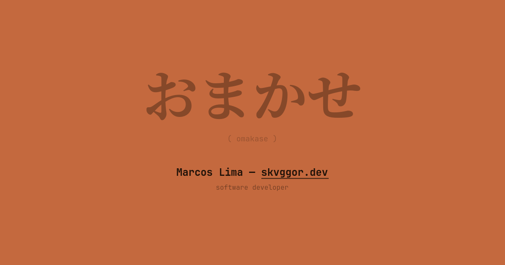

# Personal Website

Personal website with a Japanese constructivist poster aesthetic — おまかせ (omakase).



## Tech Stack

- Next.js 16 with App Router
- React 19
- Tailwind CSS 4
- TypeScript 6
- Motion (Framer Motion)
- Phosphor Icons
- Biome (linting/formatting)

## Features

- Six Japanese-inspired color themes (Terracotta, Sumi, Matcha, Washi, Ai, Sakura)
- i18n support (EN / PT-BR) with browser auto-detection
- CSS entrance animations (SSR-safe, no JS on load)
- Proportional scaling from mobile to 4K
- Live status, Strava and Last.fm integrations
- SEO metadata, JSON-LD structured data, sitemap

## Development

### Prerequisites

- Node.js 24+
- npm or yarn

### Setup

1. Clone the repository
2. Install dependencies:

```bash
npm install
```

3. Configure environment variables (optional):

```bash
cp .env.example .env
```

## Environment Variables

| Variable | Description | Required |
|----------|-------------|----------|
| `APP_ENV` | Environment mode (`development` or `production`) | No |
| `SITE_DOMAIN` | Custom domain name displayed in header | No |
| `URL_STRAVA_API_DEV` | Strava API URL for development | No |
| `URL_STRAVA_API_PROD` | Strava API URL for production | No |
| `URL_LASTFM_API_DEV` | Last.fm API URL for development | No |
| `URL_LASTFM_API_PROD` | Last.fm API URL for production | No |
| `URL_STATUS_API_DEV` | Status API URL for development | No |
| `URL_STATUS_API_PROD` | Status API URL for production | No |

### Run Development Server

```bash
npm run dev
```

Open [http://localhost:3000](http://localhost:3000)

## Production

### Without Docker

```bash
npm run build
npm run start
```

### With Docker

```bash
docker build -t personal-website .
```

#### Using Docker Compose

1. Copy the example file:

```bash
cp compose.yml.example compose.yml
```

2. Edit `compose.yml` with your domains and settings
3. Create Caddy network (if not exists):

```bash
docker network create caddy_net
```

4. Start containers:

```bash
docker compose up -d
```

## Project Structure

```
.
├── app/          # App Router (Next.js)
├── components/   # React components
├── content/      # Markdown content (announcements)
├── lib/          # Utilities and i18n
└── public/       # Static files
```

## Available Scripts

- `dev` — Development server with Turbopack
- `build` — Production build with type checking
- `start` — Production server
- `type-check` — TypeScript checking
- `lint` — Linting with Biome
